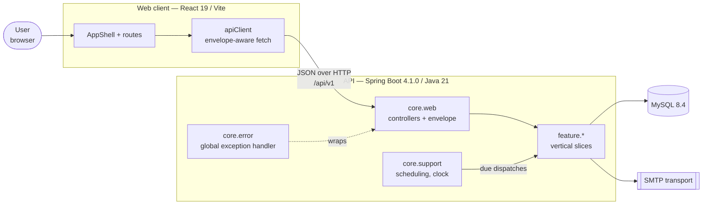
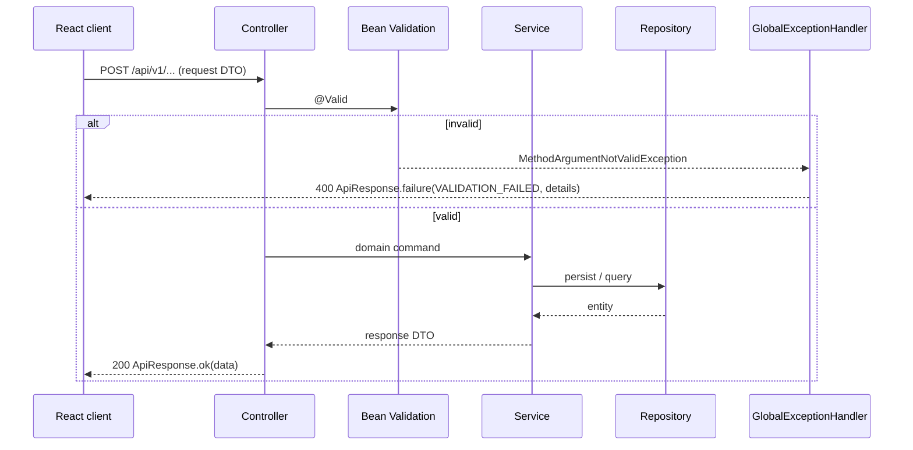
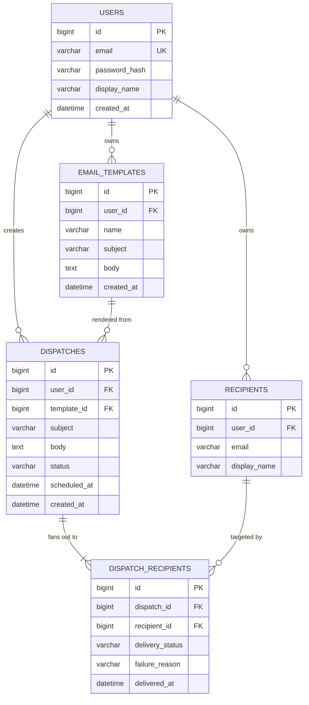

<div align="center">

# EmailAutomata

**Compose. Schedule. Account for every send.**

An email dispatch workspace — templates, recipients, scheduling, and a delivery
ledger that accounts for the outcome of every message.

`Spring Boot 4.1.0` · `Java 21` · `React 19` · `MySQL 8.4`

</div>

---

## Contents

1. [Product brief](#1-product-brief)
2. [Design language](#2-design-language)
3. [Architecture](#3-architecture)
4. [Folder structure](#4-folder-structure)
5. [Technology matrix](#5-technology-matrix)
6. [API conventions](#6-api-conventions)
7. [Data model](#7-data-model)
8. [Roadmap](#8-roadmap)
9. [Local setup](#9-local-setup)
10. [Architecture decisions](#10-architecture-decisions)

---

## 1. Product brief

### The problem

Sending one email is trivial. Sending *four hundred* — from a template, to a
segmented list, at 9:00 AM next Tuesday — and then being able to answer
"did it arrive?" three weeks later is not. Most tools solve the sending and
neglect the accounting.

### The user

A small-team operator — recruiter, community manager, founder — who sends
repeatable, personalised email in batches and is accountable for whether it
landed. Not a marketing department with a Salesforce budget.

### Product principles

| Principle | What it means in the product |
|---|---|
| **Every send is accountable** | No message leaves without a durable record: recipient, template version, dispatch time, outcome. Delivery status is a first-class entity, not a boolean. |
| **The draft is never lost** | Composition persists server-side from the first keystroke. Scheduling is a state transition on an existing draft, not a separate mechanism. |
| **State is legible at a glance** | Pending, Sent, and Failed have fixed colours and a fixed pill component across every screen. A user learns the vocabulary once. |
| **Failure is information** | A failed send surfaces the provider's reason and stays in history. Nothing is silently dropped or retried into the void. |

### Explicit non-goals

Open/click tracking, A/B testing, drip sequences, CRM integration, and
deliverability scoring are deliberately out of scope. The assessment defines
the feature set; the differentiation is in how well those features are built,
not how many extras get bolted on.

---

## 2. Design language

**"Ink & Signal"** — an editorial system, not a SaaS template.

An email tool is a *publishing* tool, so the visual language borrows from print:
warm paper surfaces, deep ink text, and a single vermilion **signal** accent
held in reserve for outbound action and live state. Colour is scarce, so when it
appears it means something.

| Element | Choice | Rationale |
|---|---|---|
| Display type | Fraunces (serif) | Editorial weight on headings; distinguishes the product from the geometric-sans default |
| UI type | Inter | Neutral, high legibility at small sizes in dense tables |
| Metadata type | JetBrains Mono | Timestamps, IDs, delivery codes and counts are *data* and are typeset as data |
| Surface | Warm paper `#FAF8F4` | Reduces the clinical feel of pure white without tinting toward a brand colour |
| Accent | Vermilion `#D14A28` | Used only for outbound action, never for decoration |

**Delivery-state palette** — fixed product-wide, defined once in `tokens.css`:

| State | Colour | Meaning |
|---|---|---|
| `PENDING` | Amber `#A8741A` | Accepted, not yet handed to the mail transport |
| `SENT` | Teal `#0F7B6C` | Transport accepted the message |
| `FAILED` | Clay `#B3261E` | Transport rejected it; reason is recorded |

Every colour, spacing step, radius, and type size lives in
`frontend/src/styles/tokens.css`. No component contains a raw hex value.

---

## 3. Architecture

### Container view



### Request lifecycle

Every request follows the same path, which is why error handling and validation
can be solved once rather than per endpoint:



### Layering rules

```
controller  →  service  →  repository  →  entity
    ↑             ↑
   DTO         domain
```

- **Controllers** are thin: bind, validate, delegate, wrap. No business logic,
  no repository access.
- **Services** own transactions and business rules. They accept and return DTOs;
  entities never cross the service boundary.
- **Repositories** are Spring Data interfaces. Query logic stays declarative.
- **Entities** are never serialised to JSON. Every response shape is an explicit
  DTO, so the database schema can evolve without breaking the API contract.

### Why feature-first packages

Code is organised by **capability**, not by layer:

```
feature/template/TemplateController.java
feature/template/TemplateService.java
feature/template/TemplateRepository.java
feature/template/dto/CreateTemplateRequest.java
```

…rather than `controller/`, `service/`, `repository/` folders each holding
twenty unrelated classes. Everything one feature needs sits in one directory,
which makes a slice readable, movable, and deletable in isolation.
See [ADR-0002](docs/adr/0002-feature-first-package-layout.md).

---

## 4. Folder structure

```
EmailAutomata/
├── backend/emailautomata-api/
│   ├── src/main/java/com/emailautomata/
│   │   ├── EmailautomataApiApplication.java
│   │   ├── core/                        # cross-cutting; owned by no feature
│   │   │   ├── config/                  # AppProperties, WebConfig
│   │   │   ├── web/                     # ApiResponse, ApiError, MetaController
│   │   │   ├── error/                   # global exception handling
│   │   │   └── support/                 # clock, scheduling, shared utilities
│   │   └── feature/                     # vertical slices, one per capability
│   │       ├── identity/                # registration, login, sessions
│   │       ├── template/                # reusable email templates
│   │       ├── recipient/               # contacts and recipient lists
│   │       ├── dispatch/                # compose, schedule, send, status
│   │       └── analytics/               # dashboard aggregates
│   ├── src/main/resources/
│   │   ├── application.yml              # shared configuration
│   │   ├── application-dev.yml          # local overrides
│   │   └── db/migration/                # Flyway versioned schema
│   └── pom.xml
│
├── frontend/
│   ├── src/
│   │   ├── components/
│   │   │   ├── brand/                   # Wordmark
│   │   │   ├── layout/                  # AppShell
│   │   │   └── ui/                      # StatusPill and future primitives
│   │   ├── pages/                       # route-level screens
│   │   ├── lib/                         # apiClient
│   │   ├── config/                      # env access
│   │   └── styles/                      # tokens.css, base.css
│   ├── vite.config.js
│   └── package.json
│
├── docs/adr/                            # architecture decision records
└── README.md
```

---

## 5. Technology matrix

Versions are locked. Spring Boot's dependency management resolves the
transitive Spring versions listed below — they are recorded here for
traceability, not overridden in `pom.xml`.

### Backend

| Component | Version | Notes |
|---|---|---|
| Spring Boot | **4.1.0** | Released 10 June 2026 |
| Spring Framework | 7.0.8 | Minimum required by Boot 4.1.0; managed by the BOM |
| Spring Security | 7.1.0 | Managed; introduced in the identity commit |
| Spring Data BOM | 2026.0.0 | Managed |
| Java | **21 (LTS)** | Boot 4.1 supports Java 17–26; 21 chosen as current LTS |
| Jakarta EE | 11 | Servlet 6.1 baseline |
| Jackson | 3.x | Boot 4 default — databind moved to `tools.jackson.*` |
| JUnit | 6.x | Boot 4 default test platform |
| MySQL | 8.4 (LTS) | Via `mysql-connector-j` |
| Flyway | 12.x | Managed; versioned schema migrations |
| Maven | 3.9+ | Wrapper committed (`./mvnw`) |

### Frontend

| Component | Version |
|---|---|
| React | 19.1.x |
| React Router | 7.6.x |
| Vite | 7.x |
| Node.js | 20 LTS or newer |

> **Boot 4 migration notes carried by this project:** Jackson 3 replaces
> Jackson 2 (annotation coordinates unchanged, databind package moved);
> Undertow support is removed, so Tomcat is the embedded server; classes
> deprecated in Boot 3.x no longer exist. Code in this repo is written against
> the 4.x API directly — no 3.x patterns were carried over.

---

## 6. API conventions

**Base path:** `/api/v1` · **Media type:** `application/json`

### Response envelope

Every endpoint — success or failure — returns the same shape, so the client has
exactly one unwrapping path and one error path.

Success:
```json
{
  "success": true,
  "data": { "product": "EmailAutomata", "apiVersion": "v1" },
  "timestamp": "2026-08-06T21:03:46.272902+05:30"
}
```

Failure:
```json
{
  "success": false,
  "error": {
    "code": "VALIDATION_FAILED",
    "message": "One or more fields are invalid.",
    "details": { "subject": "must not be blank" }
  },
  "timestamp": "2026-08-06T21:03:46.272902+05:30"
}
```

`error.code` is a stable, machine-readable identifier. The client branches on
the code; `message` is what the user reads. See
[ADR-0003](docs/adr/0003-uniform-api-response-envelope.md).

### Status codes

| Code | Used for |
|---|---|
| `200` | Successful read or update |
| `201` | Resource created |
| `204` | Successful delete |
| `400` | Validation failure or malformed request |
| `401` | Missing or invalid credentials |
| `403` | Authenticated but not permitted |
| `404` | Resource does not exist or is not owned by the caller |
| `409` | Conflict (duplicate email, illegal state transition) |
| `500` | Unhandled server fault — never leaks a stack trace |

### Conventions

- Plural, noun-based collection resources: `/api/v1/templates`
- Pagination via `?page=0&size=20&sort=createdAt,desc`
- All timestamps are ISO-8601 with offset
- Ownership is enforced in the service layer — a `404` is returned rather than a
  `403` for another user's resource, so IDs are not enumerable

---

## 7. Data model

Preview of the target schema. Tables arrive incrementally, each in the commit
that needs it, via Flyway migrations.



**The design decision worth noting:** delivery status lives on
`DISPATCH_RECIPIENTS`, not on `DISPATCHES`. One send to 400 people can succeed
for 397 and fail for 3. A status column on the parent would force that outcome
into a single misleading value; per-recipient rows record what actually happened
and make the dashboard's numbers truthful.

---

## 8. Roadmap

One functional requirement per commit. Infrastructure lands before the features
that depend on it, so the application builds and runs at every commit.

| # | Commit | Functional requirement | Status |
|---|---|---|---|
| 01 | Project initialisation & skeleton | — | ✅ Done |
| 02 | Product requirements, architecture & roadmap | — | ✅ Done |
| 03 | MySQL integration & schema foundation | MySQL Integration | ⬜ |
| 04 | Global exception handling & validation | Exception Handling & Validation | ⬜ |
| 05 | User registration & login | User Registration & Login | ⬜ |
| 06 | Email templates | Email Templates | ⬜ |
| 07 | Compose emails | Compose Emails | ⬜ |
| 08 | Single & multiple recipients | Single & Multiple Recipients | ⬜ |
| 09 | Instant send | Instant Send | ⬜ |
| 10 | Schedule emails | Schedule Emails | ⬜ |
| 11 | Delivery status tracking | Delivery Status (Pending/Sent/Failed) | ⬜ |
| 12 | Sent history | Sent History | ⬜ |
| 13 | Search & filter | Search & Filter | ⬜ |
| 14 | Dashboard & statistics | Dashboard & Statistics | ⬜ |
| 15 | Responsive UI pass | Responsive UI | ⬜ |
| 16 | REST API documentation & hardening | REST APIs | ⬜ |

---

## 9. Local setup

### Prerequisites

- JDK 21 — verify with `java -version`
- Node.js 20+ — verify with `node -v`
- MySQL 8.4 — required from Commit 03 onward

### Backend

```bash
cd backend/emailautomata-api
./mvnw spring-boot:run
```

API at `http://localhost:8080`. Verify:

```bash
curl http://localhost:8080/api/v1/meta
curl http://localhost:8080/actuator/health
```

### Frontend

```bash
cd frontend
cp .env.example .env
npm install
npm run dev
```

UI at `http://localhost:5173`. Vite proxies `/api` to port 8080, so the browser
sees a single origin in development.

### Tests

```bash
cd backend/emailautomata-api && ./mvnw test
```

---

## 10. Architecture decisions

Significant decisions are recorded as ADRs in [`docs/adr/`](docs/adr/).

| ADR | Decision |
|---|---|
| [0001](docs/adr/0001-record-architecture-decisions.md) | Record architecture decisions |
| [0002](docs/adr/0002-feature-first-package-layout.md) | Organise backend packages by feature, not by layer |
| [0003](docs/adr/0003-uniform-api-response-envelope.md) | Wrap every API response in a uniform envelope |