# EmailAutomata

**Email Automation Agent — a web application for composing, scheduling, and tracking bulk personalised email.**

Templates with merge fields, recipient lists, instant and scheduled sending, and a
per-recipient delivery ledger that records the outcome of every message.

`Spring Boot 4.1.0` · `Java 21` · `React 19` · `MySQL 8.4`

**Author:** Tejprakash Mirahi

---

## Overview

EmailAutomata lets a user send repeatable, personalised email in batches and then
account for what happened to each message.

A template declares the merge fields it needs (`{{firstName}}`, `{{role}}`); a
recipient supplies the values. At compose time, every recipient's message is
rendered and anyone missing a required field is flagged before anything is queued.
At send time, delivery is tracked per recipient — Pending, Sent, or Failed — with
the failure reason recorded. Nothing is silently dropped, and nothing broken is sent.

### Features

- User registration and login (JWT, BCrypt-hashed passwords)
- Create and manage reusable email templates with `{{merge}}` fields
- Add recipients individually or import a whole list from CSV
- Compose an email to one or many recipients
- Send instantly, or schedule for automatic future delivery
- Per-recipient delivery status: Pending / Sent / Failed
- Sent history with status filters and subject search
- Dashboard with totals, delivery rate, and a status breakdown
- Responsive UI, RESTful API, global exception handling and validation

---

## Tech stack

**Backend**
- Spring Boot 4.1.0, Java 21
- Spring Web, Spring Security (JWT), Spring Data JPA / Hibernate
- Flyway (versioned schema migrations)
- MySQL 8.4
- JJWT 0.12.6, Maven

**Frontend**
- React 19, React Router 7, Vite 7
- Token-based design system (plain CSS, no framework)

**Infrastructure**
- Docker Compose (local MySQL)

---

## Architecture

The backend is organised **by feature** rather than by layer: each capability
(`identity`, `template`, `recipient`, `dispatch`, `analytics`) owns a vertical
slice containing its controller, service, repository, entity, and DTOs.
Cross-cutting concerns — the response envelope, global error handling, security,
persistence config — live under `core`.


Controllers only bind, validate, and delegate. Services own transactions and
business rules and deal in DTOs; entities are never serialised to JSON directly.
Every endpoint returns a uniform response envelope:

###```json
{ "success": true,  "data": { ... }, "timestamp": "..." }
{ "success": false, "error": { "code": "...", "message": "...", "details": {} }, "timestamp": "..." }
```

The database schema is owned by Flyway and applied on startup; Hibernate is set to
`validate`, so the application refuses to start if an entity drifts from a migration.

---

## Getting started

### Prerequisites
- JDK 21
- Node.js 20+
- Docker (or a local MySQL 8.4 instance)

### 1. Start the database
```bash
docker compose up -d
```

### 2. Run the backend
```bash
cd backend/emailautomata-api
./mvnw spring-boot:run
```
Flyway applies the schema on first start. API runs at `http://localhost:8080`.

### 3. Run the frontend
```bash
cd frontend
cp .env.example .env
npm install
npm run dev
```
App runs at `http://localhost:5173`.

> **Email delivery:** by default the app uses a log-based transport — sends succeed
> and are written to the backend log, so the full flow works with no SMTP setup. Set
> `MAIL_TRANSPORT=smtp` with `MAIL_HOST`, `MAIL_USERNAME`, and `MAIL_PASSWORD` to send
> real mail.

---

## Database configuration

MySQL 8.4, database `emailautomata`, pooled with HikariCP. Credentials come from
environment variables with local defaults (no secrets in source control):

| Variable | Default |
|---|---|
| `DB_URL` | `jdbc:mysql://localhost:3306/emailautomata` |
| `DB_USERNAME` | `emailautomata` |
| `DB_PASSWORD` | `emailautomata` |

`docker-compose.yml` provisions a matching instance. To use an existing MySQL:

```sql
CREATE DATABASE emailautomata CHARACTER SET utf8mb4 COLLATE utf8mb4_0900_ai_ci;
CREATE USER 'emailautomata'@'localhost' IDENTIFIED BY 'emailautomata';
GRANT ALL PRIVILEGES ON emailautomata.* TO 'emailautomata'@'localhost';
FLUSH PRIVILEGES;
```

---

## API endpoints

Base path: `/api/v1`. All endpoints except register/login require a Bearer token.

| Method | Endpoint | Description |
|---|---|---|
| `POST` | `/auth/register` | Create an account |
| `POST` | `/auth/login` | Authenticate, receive a JWT |
| `GET` | `/auth/me` | Current user profile |
| `GET` `POST` | `/templates` | List / create templates |
| `GET` `PUT` `DELETE` | `/templates/{id}` | Read / update / delete a template |
| `GET` `POST` | `/recipients` | List / create recipients |
| `PUT` `DELETE` | `/recipients/{id}` | Update / delete a recipient |
| `POST` | `/recipients/import` | Bulk import from CSV |
| `POST` | `/dispatches/compose` | Compose a draft (renders per recipient) |
| `POST` | `/dispatches/{id}/send` | Send a draft immediately |
| `POST` | `/dispatches/{id}/schedule` | Schedule for future delivery |
| `POST` | `/dispatches/{id}/cancel-schedule` | Cancel a scheduled send |
| `GET` | `/dispatches/history` | Filterable, paginated sent history |
| `GET` | `/dashboard/stats` | Aggregate statistics |

---

## Project structure
EmailAutomata/
├── backend/emailautomata-api/
│ └── src/main/java/com/emailautomata/
│ ├── core/ # config, web envelope, error handling, security, persistence
│ └── feature/ # identity, template, recipient, dispatch, analytics
├── frontend/
│ └── src/ # components, pages, lib, context, styles
├── EVIDENCES/ # application screenshots
├── docker-compose.yml
└── README.md

---

## Testing

```bash
cd backend/emailautomata-api && ./mvnw test
```

Unit tests cover placeholder extraction and rendering, CSV parsing with per-row
error reporting, the send pipeline's per-recipient outcomes, and schedule state
transitions.

---

## Screenshots

### Authentication
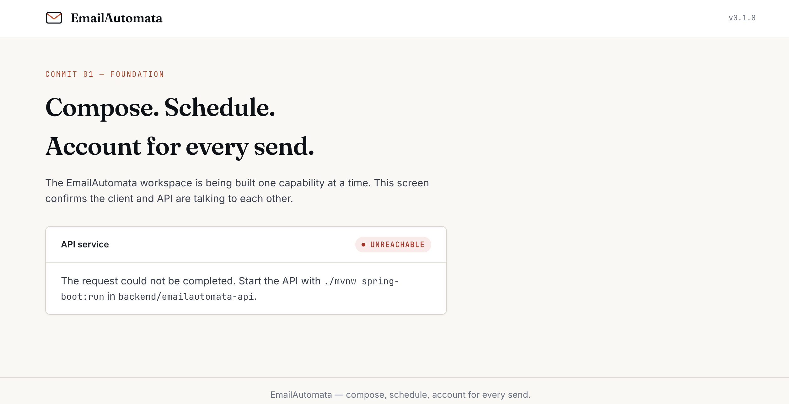
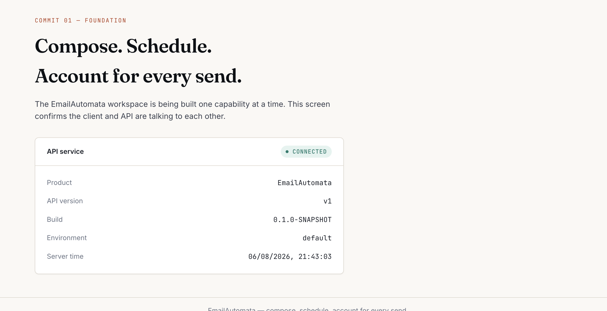

### Database
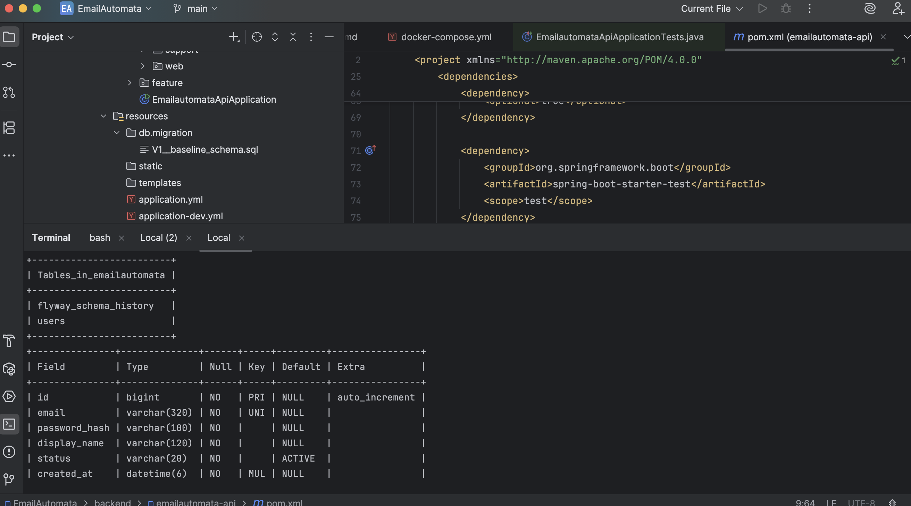

### Templates with merge fields
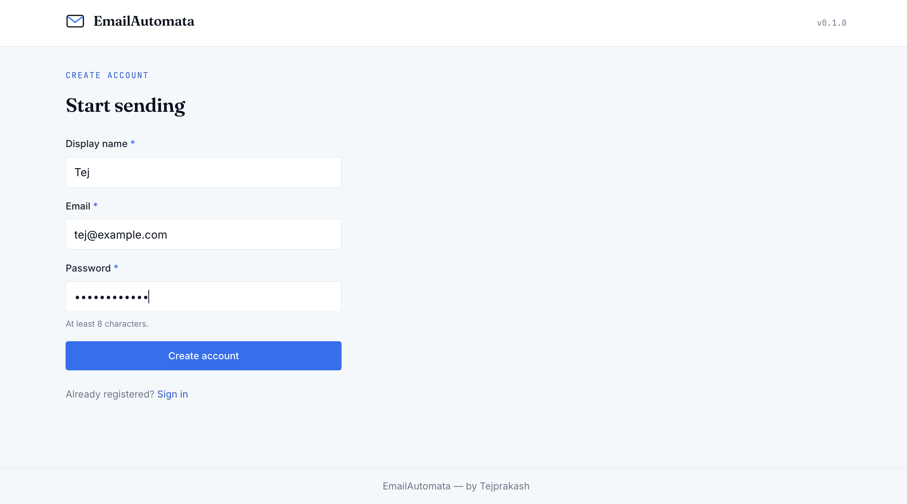

### Recipients and CSV import
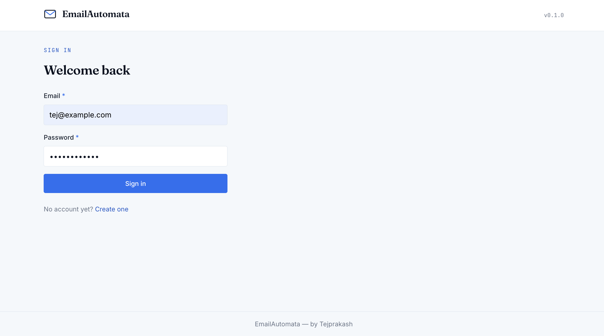
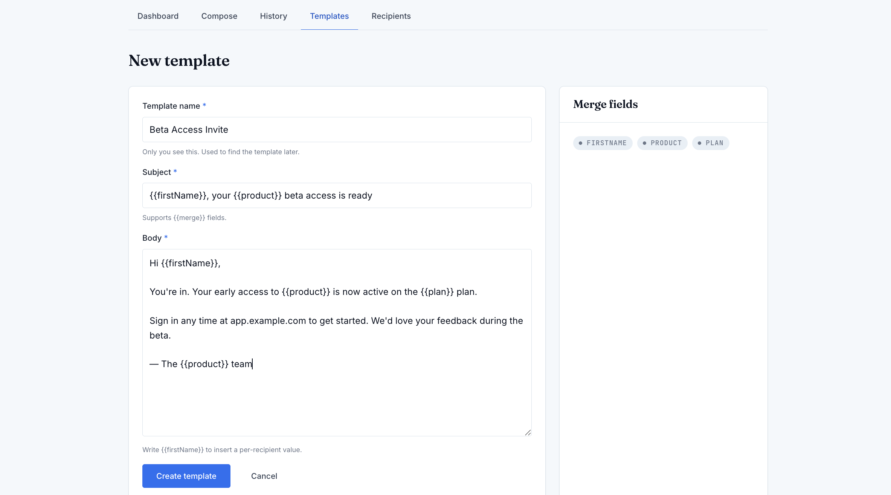

### Compose and delivery
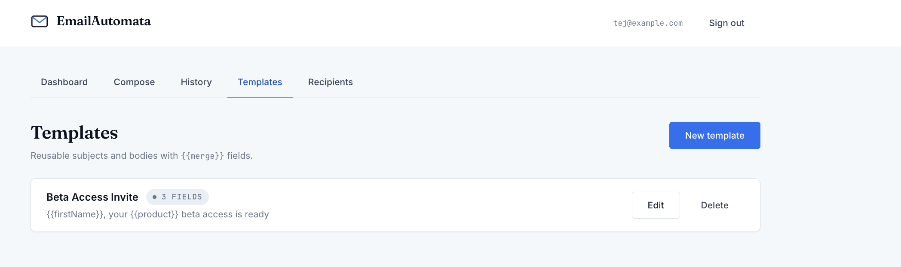
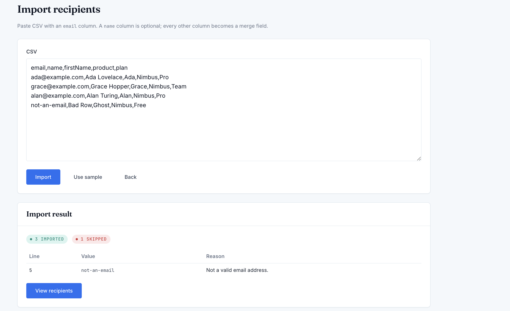

### Sent history, search and filter
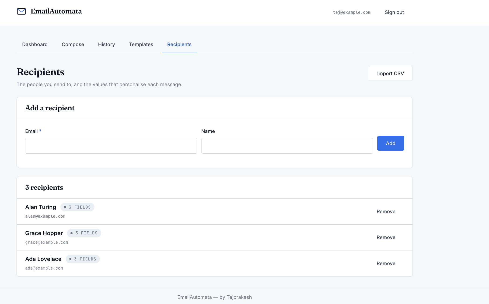
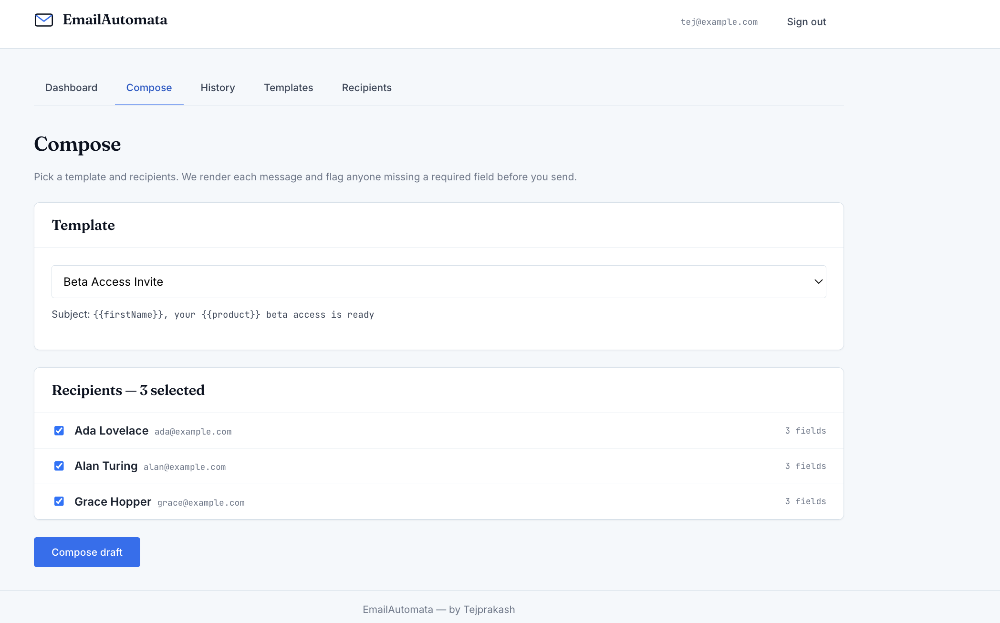

### Dashboard
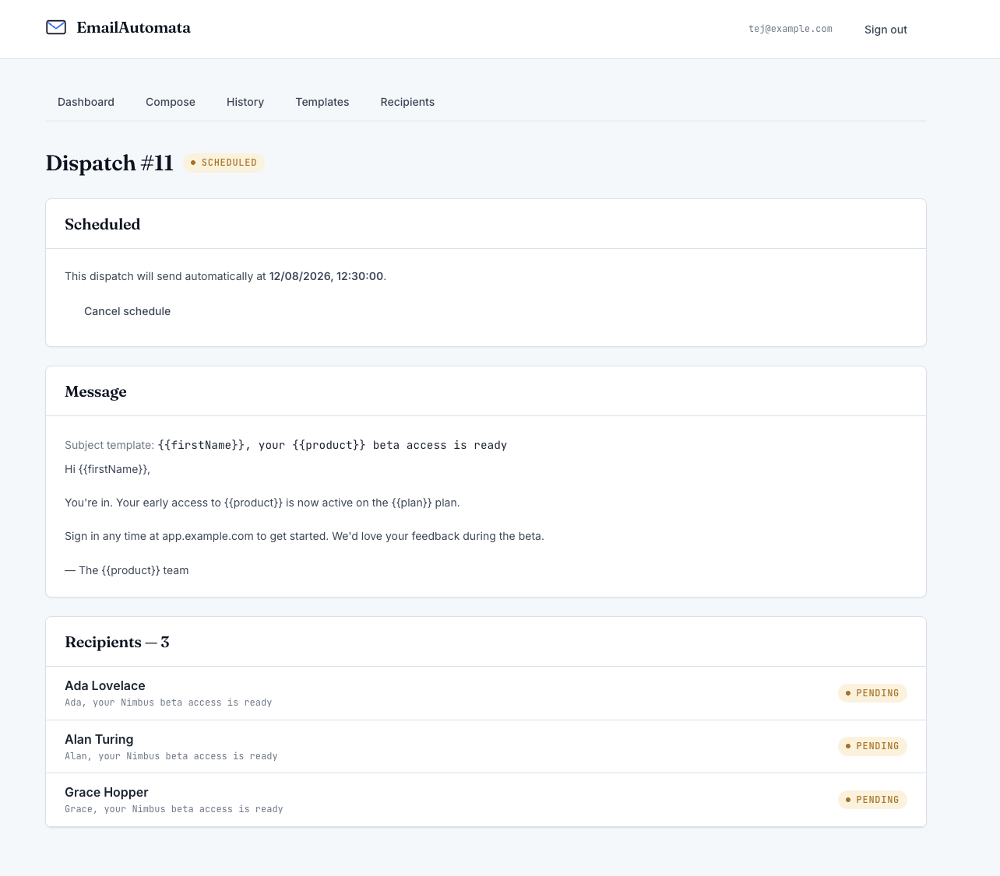
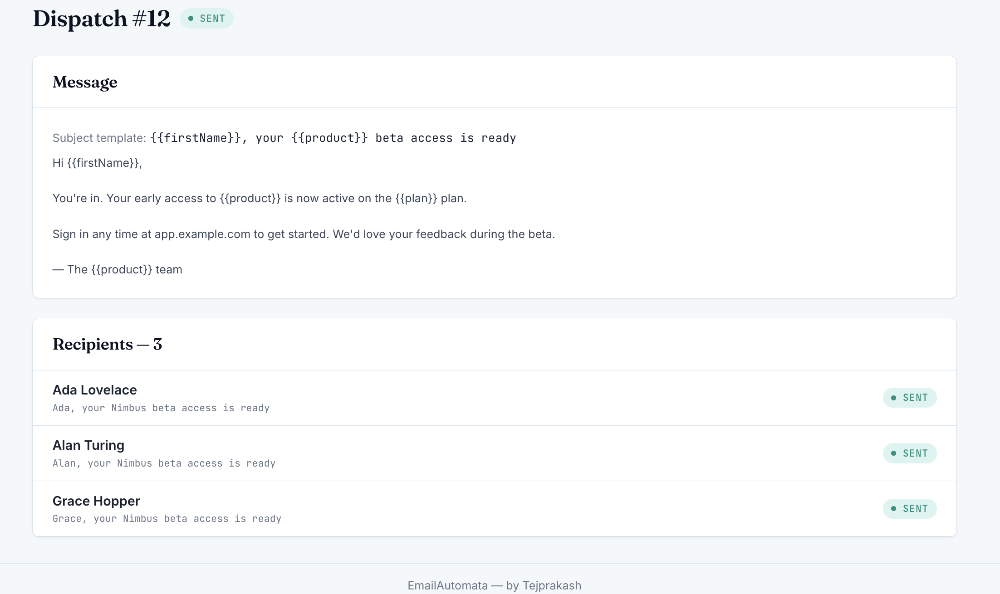

### Scheduling
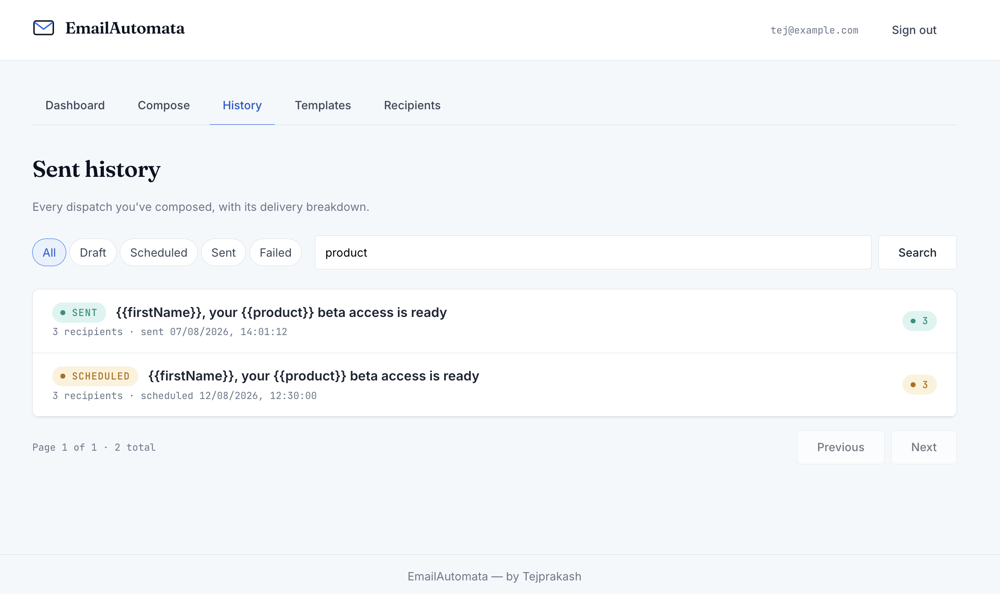

### Responsive layout
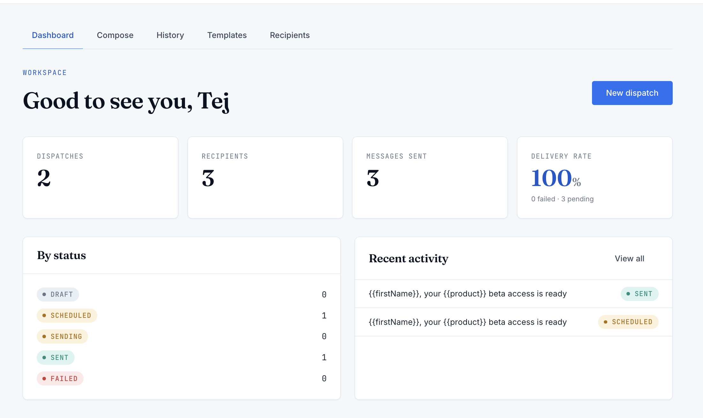

---

*Built by Tejprakash Mirahi.*